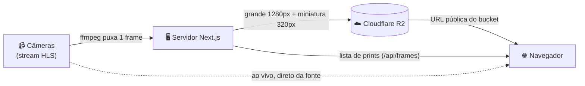

<div align="center">

# 🌊 Câmeras Rolante

**Câmeras ao vivo dos rios de Rolante/RS, com histórico de prints gravado 24 horas por dia.**

[](https://cameras-rolante.onrender.com)

[](https://github.com/filipesfbr/cameras-rolante/actions/workflows/ci.yml)


[](LICENSE)

</div>

---

## 📍 O que é

Um site que mostra as câmeras de monitoramento dos rios de Rolante/RS **ao vivo** e guarda um **histórico de
prints**. As câmeras apontam para uma régua graduada e queimam data e hora na imagem, então o histórico
mostra a evolução do nível do rio, inclusive de madrugada, quando ninguém está olhando.

O projeto apenas exibe as imagens. Os links das câmeras vêm do portal
[alerta.rolante.ifrs.edu.br](https://alerta.rolante.ifrs.edu.br/niveis-rios-arroios), e os streams são
carregados das páginas das câmeras em `rolante.solutti.net`.

## ✨ O que tem

- 🔴 **Ao vivo** direto no navegador (HLS com [hls.js](https://github.com/video-dev/hls.js)), com reconexão
  automática, contagem regressiva, aviso `FORA DO AR` e detecção de stream travado.
- 🖼️ **Mosaico em tela cheia** com todas as câmeras de uma vez.
- 🕰️ **Histórico por câmera:** faixa de miniaturas com rolagem infinita para trás. Print novo entra sozinho,
  clicar amplia, e as setas `←` `→` (botões e teclado) navegam entre os prints, com o horário sobre a imagem.
  O botão **Ao vivo** volta para o vídeo.
- 🤖 **Captura 24/7 no servidor:** grava mesmo com ninguém com o navegador aberto.

## 🧭 Como funciona



1. O servidor Node roda **um timer por câmera**. A cada ciclo (por padrão, de 15 em 15 minutos) o `ffmpeg`
   lê o stream e extrai **um frame**, sem abrir navegador.
2. Numa única chamada ele gera duas versões, a **grande** (1280 px) e a **miniatura** (320 px), e sobe as duas
   para o Cloudflare R2. O container não guarda nada em disco.
3. No site, o vídeo ao vivo vem direto da fonte. Já as imagens do histórico vêm direto do R2; o servidor só
   entrega a lista de nomes.

## 🗂️ Onde as imagens ficam salvas

No **Cloudflare R2** (armazenamento compatível com S3), num bucket com leitura pública. Não há banco de dados:

```
bucket/
  shots/<câmera>/<AAAA-MM-DD>/<HHmmss>.jpg         imagem grande, 1280 px, ~180 KB
  shots/<câmera>/<AAAA-MM-DD>/<HHmmss>.thumb.jpg   miniatura, 320 px, ~10 KB
  config.json                                       configuração do app (não guarde segredo nele)
```

- O nome do arquivo já é o identificador do print, e a **ordem alfabética é a ordem cronológica**, então não
  precisa de índice.
- O dia é sempre o de **Brasília**, independente do fuso do servidor.
- **Retenção:** por padrão, 30 dias. Uma varredura própria, ao subir e a cada 24 h, apaga os dias mais velhos.

## 🛠️ Stack

| Camada | Tecnologia |
|---|---|
| App | [Next.js](https://nextjs.org) 16 (App Router) + TypeScript, CSS Modules |
| Vídeo ao vivo | [hls.js](https://github.com/video-dev/hls.js) |
| Captura | [ffmpeg](https://ffmpeg.org) rodando dentro do processo do servidor |
| Armazenamento | Cloudflare R2, via `@aws-sdk/client-s3` |
| Deploy | Docker no [Render](https://render.com) |
| CI e releases | GitHub Actions |

## ⚠️ Limites conhecidos

- O carimbo de horário queimado pela câmera fica cerca de 2 minutos atrás do nome do arquivo: é o relógio e a
  latência da câmera, não o fuso. O rodapé do site avisa isso.
- A captura só aceita URLs `https` que resolvam para IP público. Um playlist remoto que redirecione ou aponte
  segmentos para um endereço interno não é filtrado pela aplicação; fechar isso exige restringir a saída de rede
  do container.
- Se a fonte de uma câmera cair, a captura dela dá timeout (30 s) e tenta de novo no ciclo seguinte, sem afetar
  as outras.

## 📄 Licença e créditos

Licença **MIT**, veja [`LICENSE`](LICENSE). Este site não é responsável pelo conteúdo, disponibilidade ou
propriedade das câmeras.

As imagens são exibidas através do portal [alerta.rolante.ifrs.edu.br](https://alerta.rolante.ifrs.edu.br/niveis-rios-arroios)
e das páginas de câmera em [rolante.solutti.net](https://rolante.solutti.net/rioareia/).
